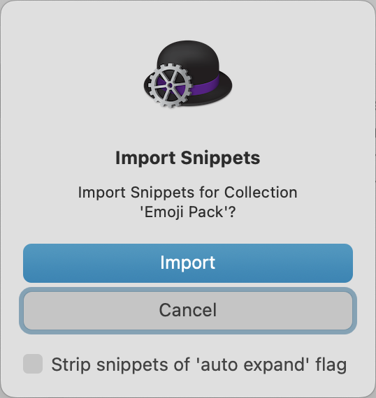

# Emojipack Generator

👋 This is David's Emoji Pack Generator.

🤷‍♂️ It's probably not very different from [the][joelc] [five][purpleb]
[other][parisci] [emoji][steganz] [packs][joew] that I could find when I wrote
this README, but it's there.

[joelc]: https://github.com/califa/alfred-emoji-pack
[purpleb]: https://github.com/PurpleBooth/alfred-emoji-snippet-pack
[parisci]: https://github.com/paris-ci/Alfred-Emoji-Pack-Update
[steganz]: https://github.com/stefanzweifel/alfred-emoji-pack
[joew]: https://blog.joewoods.dev/technology/the-alfred-emoji-pack-with-skin-tone-modifiers/

💡 And it does have one original feature: the generation of macOS text
replacement shortcuts!

⬇️ It downloads the latest data from GitHub's [genmoji] database, and can build
an [📋 Alfred snippet] pack. Keywords with multiple words are separated by
spaces, like `:ok hand:`, so they are easier to type.

[genmoji]: https://github.com/github/gemoji
[📋 Alfred snippet]: https://www.alfredapp.com/help/features/snippets/

🍎 The [macOS text replacement] feature does, at the operating system level,
the same thing as Alfred automatically expanded snippets.

🎉 And as a bonus, that makes the expansions available on your iOS devices:
iPhones and iPads.

[macOS text replacement]: https://support.apple.com/en-gb/guide/mac-help/mh35735/mac

🌐 It turns out, Apple _does_ have some built-in support for emoji shortnames,
in the form of _[Add emoji as you type]_ suggestions. They are triggered by
pressing Fn/🌐-E.

[Add emoji as you type]: https://support.apple.com/en-gb/guide/mac-help/mchlp1560/mac#mchl955c679b

## Usage

### Alfred

🎩 To build Emoji Pack and open with Alfred:

```sh
just install
```

⚠️ Be careful to **uncheck** the "Strip snippets of 'auto expand' flag"
checkbox in the confirmation dialog that appears.

<div style="text-align: center"></div>

### macOS

🍎 To use the macOS text replacements, build the plist file.

🍡 Space characters are not allowed in text replacement shortcuts, so multiple
words are separated by "-", like `:ok-hand:`.

```sh
just build
```

⚙️ Then open System Settings → Keyboard. With Alfred 5 on macOS 15.6, just search
for "keyboard" in the Alfred bar.

👉 Click on the "Text Replacements…" button, a window appear where you can  add,
modify and remove entries.

🪂 Drag and drop the "Emoji Pack.plist" file into the window.

💣 Ignore the cryptic error message:
**Error Domain=KSTextReplacementErrorDomain Code=-2 "(null)"**

🧘 Really, just ignore the error. The replacements _have_ been successfully
loaded.

🔧 If you want to use another format than `:smile:`, you can run the generate
command with custom options. There are only three options.

```sh
# Makes 'build/Emoji Pack.plist', with shortcuts like ".smile."
just generate --macos --prefix . --suffix .
# With shortcuts like ".smile"
just generate --macos --prefix . --suffix=''
```
